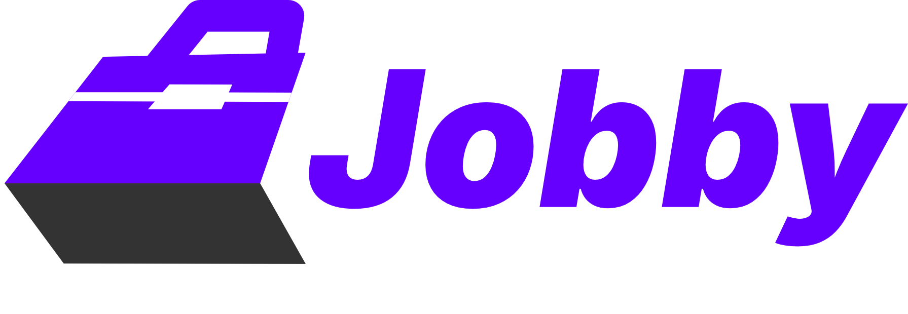
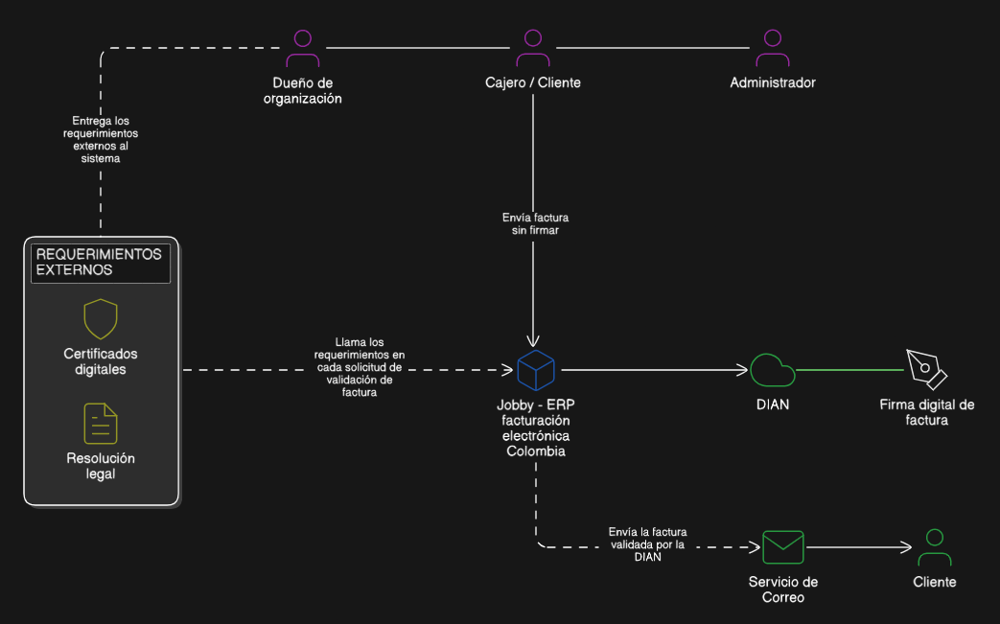
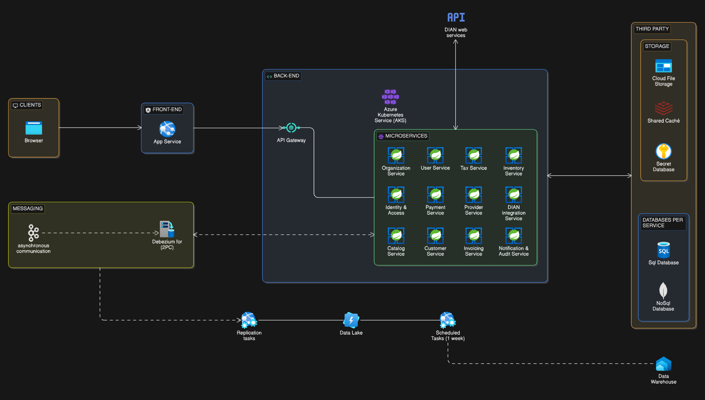

<div align="center">

  
  <h1>Jobby ERP</h1>

  <p><strong>Plataforma de facturación electrónica Colombiana para PYMES —<br/>clásica y POS — construida sobre una arquitectura de microservicios diseñada para no caerse nunca.</strong></p>

  <p>
    <a href="https://github.com/AmpolStack/jobby-erp-backend/blob/main/LICENSE">
      
    </a>
    <a href="https://github.com/AmpolStack/jobby-erp-backend/actions">
      
    </a>
    <a href="https://github.com/AmpolStack/jobby-erp-backend/releases">
      
    </a>
    <a href="https://github.com/AmpolStack/jobby-erp-backend/issues">
      
    </a>
    <a href="https://github.com/AmpolStack/jobby-erp-backend/stargazers">
      
    </a>
  </p>

  <p>
    <a href="#-overview">Overview</a> ·
    <a href="#-objectives">Objectives</a> ·
    <a href="#-architecture">Architecture</a> ·
    <a href="#-tech-stack">Tech Stack</a> ·
    <a href="#-getting-started">Getting Started</a> ·
    <a href="#-roadmap">Roadmap</a> ·
    <a href="#-contributing">Contributing</a> ·
    <a href="#-español">Español</a>
  </p>
</div>

---

## 📋 Overview

**Jobby ERP** is an open-source electronic invoicing platform built specifically for Colombian SMEs. It covers both **classic electronic invoicing** and **POS invoicing**, fully aligned with DIAN's regulatory framework and the UBL 2.1 standard.

The project was born from a recurring observation: most invoicing solutions available in the Colombian market share the same fundamental problems — monolithic architectures that fall apart under load, interfaces that make basic operations unnecessarily complex, and systems that go down precisely when businesses need them most.

Jobby ERP approaches these problems from the ground up with an **independent microservices architecture**, designed for fault isolation and high availability, while keeping the end-user experience simple, intuitive, and modern. It is intended to be a real, production-grade product — and at the same time, a fully open-source project that any developer can learn from, contribute to, and build upon.

---

## 🎯 Objectives

### General Objective

Create a complete, viable, and production-ready application that solves the electronic invoicing problem for Colombian SMEs — providing a platform engineered for maximum availability, and designed above all to be **easy to learn, intuitive, and visually modern**.

### Specific Objectives

**1. Best practices in microservices, documented for learning.**
Implement a real microservices product that applies industry-standard patterns — CQRS, Database per Service, Outbox Pattern, Result Pattern, and others — while producing detailed technical documentation explaining how each pattern works, why it was chosen, its trade-offs, and how it manifests in a real codebase. The goal is that any developer who studies this project comes away with a deeper, practical understanding of distributed systems.

**2. A product with real-world adoption.**
Beyond being a reference project, Jobby ERP is designed to be adopted by actual businesses. Architectural decisions, UX choices, and feature priorities are all made with real Colombian SME operators in mind.

**3. Open source as a first-class value.**
This project is built in public and will remain open source regardless of its commercial trajectory. The intention is to demonstrate that open source and product quality are not in tension — and to contribute meaningfully to the Latin American developer community.

---

## 🏗️ Architecture

### C1 — System Context

> Who interacts with Jobby ERP, and which external systems does it depend on?

<div align="center">
  
</div>

**Actors**

- **Business Owner / SME Operator** — Configures the platform, manages users, monitors invoicing operations, and reviews financial reports.
- **Accountant / Cashier** — Issues classic and POS electronic invoices in day-to-day operations.
- **Developer / Integrator** — Connects external systems to Jobby ERP via the REST API.

**External Systems**

- **DIAN** — Colombian tax authority. Receives, validates, and registers all electronic documents via its official web services.
- **Email Provider** — Delivers invoice notifications and PDF attachments to customers.
- **OAuth 2.0 Provider** — Issues and validates identity tokens for authentication.
- **Third-party systems** — External ERP or POS systems that integrate via API.

---

### C2 — Container Architecture

> What are the internal services that compose Jobby ERP?

<div align="center">
  
</div>

The platform is composed of independently deployable services. Each service owns its data (Database per Service), communicates synchronously via REST where latency matters, and asynchronously via events where decoupling and resilience take priority.

**Architectural patterns applied**

| Pattern | Purpose |
|---|---|
| **CQRS** | Separate read and write models for invoicing and reporting workloads |
| **Database per Service** | Each service owns its schema; no shared databases |
| **Outbox Pattern** | Guarantees event delivery between services without distributed transactions |
| **Result Pattern** | Explicit, typed error handling across service boundaries |
| **API Gateway** | Single entry point for routing, rate limiting, and auth enforcement |
| **Event-driven communication** | Async messaging for non-critical flows (notifications, analytics ingestion) |

[aquí tu descripción de los servicios individuales una vez los tengas definidos]

---

## 🛠️ Tech Stack

**Backend services** use **Spring Boot** as the default framework. Services with specific asynchronous, reactive, or performance-critical requirements use **Quarkus** or **Micronaut** where their runtime characteristics provide a meaningful advantage.

| Layer | Technology |
|---|---|
| Default service framework | Spring Boot |
| Async / reactive services | Quarkus · Micronaut |
| Analytics & ETL | Python |
| [mensajería] | [aquí tu elección: Kafka, RabbitMQ, etc.] |
| [base de datos operacional] | [aquí tu elección: PostgreSQL, etc.] |
| [infraestructura] | [Docker · Kubernetes · etc.] |
| API specification | OpenAPI 3.x |

---

## 🇨🇴 Colombian Compliance

Jobby ERP is built around the DIAN's current technical and regulatory framework:

- **Resolución 000042 de 2020** — Technical requirements for electronic invoicing.
- **UBL 2.1** — XML schema standard for all electronic documents.
- **CUFE / CUDE** — Unique codes for invoices and equivalent documents.
- **XAdES-B signing** — Mandatory XML digital signature with a DIAN-issued certificate.
- **Contingency mode** — Offline document issuance with subsequent DIAN synchronization.

Full compliance documentation is available in [`docs/compliance/`](docs/compliance/).

---

## 🚀 Getting Started

[coming soon]

In the meantime, see [`docs/guides/local-setup.md`](docs/guides/local-setup.md) for the most up-to-date setup instructions.

---

## 🗺️ Roadmap

See the full [open issues](https://github.com/[tu-usuario]/jobby-erp/issues) and [project board](https://github.com/[tu-usuario]/jobby-erp/projects) for detailed progress.

---

## 📚 Technical Documentation

One of the explicit goals of this project is to serve as a learning resource. The [`docs/`](docs/) directory contains:

- **Architecture Decision Records (ADRs)** — Every significant architectural choice is documented with its context, the options considered, the decision made, and its consequences. See [`docs/architecture/adr/`](docs/architecture/adr/).
- **Pattern guides** — In-depth explanations of each pattern applied (CQRS, Outbox, Result Pattern, etc.) in the context of this specific codebase.
- **Service documentation** — Per-service documentation covering responsibilities, API contracts, data models, and event schemas.
- **A technical article series** — Published progressively as the project evolves. See [`docs/articles/`](docs/articles/).

---

## 🤝 Contributing

Contributions, feedback, and domain expertise are all welcome — especially from developers working with Colombian electronic invoicing.

```bash
# 1. Fork the repository
# 2. Create a feature branch
git checkout -b feat/your-feature-name

# 3. Commit using Conventional Commits
git commit -m "feat(billing): add credit note generation"

# 4. Push and open a Pull Request
git push origin feat/your-feature-name
```

Please read [`CONTRIBUTING.md`](CONTRIBUTING.md) before submitting. By participating you agree to the [`CODE_OF_CONDUCT.md`](CODE_OF_CONDUCT.md).

---

## 📄 License

Distributed under the **MIT License**. See [`LICENSE`](LICENSE) for full terms.

This project is and will remain open source. See the [Objectives](#-objectives) section for the reasoning behind this commitment.

---

## 📬 Contact

Have questions, ideas, or experience with Colombian invoicing systems? Open a [Discussion](https://github.com/[tu-usuario]/jobby-erp/discussions) — that is the right place for it.

---
---

## 🇪🇸 Español

### Descripción general

**Jobby ERP** es una plataforma de facturación electrónica open source construida para las pymes colombianas. Cubre tanto la **facturación electrónica clásica** como la **facturación POS**, alineada con la normativa de la DIAN y el estándar UBL 2.1.

El proyecto nació de una observación recurrente: la mayoría de soluciones de facturación en Colombia comparten los mismos problemas de fondo — arquitecturas monolíticas que colapsan bajo carga, interfaces que complican operaciones básicas, y sistemas que se caen justo cuando más se necesitan.

Jobby ERP aborda estos problemas desde cero con una **arquitectura de microservicios independientes**, diseñada para alta disponibilidad y aislamiento de fallas, manteniendo al mismo tiempo una experiencia de usuario simple, intuitiva y visualmente moderna.

### Objetivos

**General:** Crear una aplicación completa y viable que resuelva el problema de la facturación electrónica para las pymes colombianas — una plataforma diseñada para no caerse nunca, y que sea sobre todo fácil de aprender, intuitiva y agradable a la vista.

**Específicos:**
- Implementar las mejores prácticas en microservicios y documentarlas de forma que cualquier programador pueda aprender cómo funcionan, sus ventajas, desventajas y cómo se aplican en un producto real.
- Construir un producto que alcance acogida real en el mercado y pueda sostenerse como una aplicación en producción.
- Promover el open source demostrando que calidad de producto y apertura del código no son objetivos contradictorios.

### Inicio rápido

[Pronto]

### Documentación técnica

El directorio [`docs/`](docs/) contiene ADRs, guías de patrones, documentación por servicio y una serie de artículos técnicos publicados progresivamente. Ver [`docs/articles/`](docs/articles/).

### Contribuciones

Si trabajas con facturación electrónica en Colombia o tienes experiencia en el dominio, tu aporte es especialmente valioso. Abre un [Issue](https://github.com/[tu-usuario]/jobby-erp/issues) o una [Discussion](https://github.com/[tu-usuario]/jobby-erp/discussions) para comenzar.